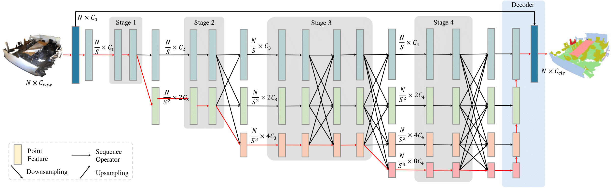
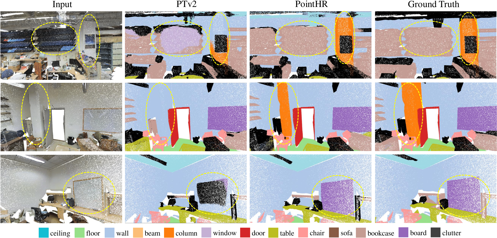
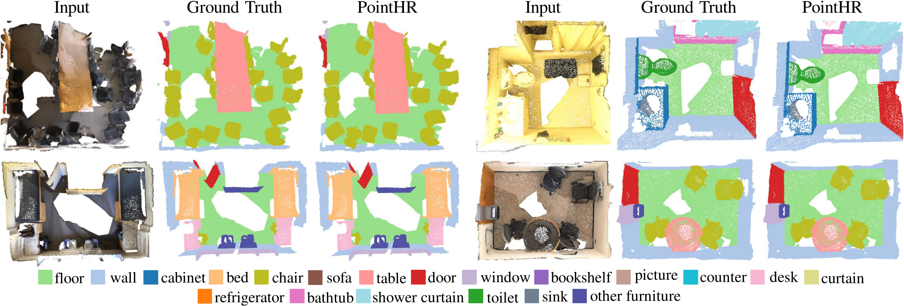

# PointHR [](https://arxiv.org/abs/2310.07743) 
This is the PyTorch implementation for our following paper:
>**[PointHR: Exploring High-Resolution Architectures for 3D Point Cloud Segmentation](https://arxiv.org/abs/2310.07743)**
>
>*Haibo Qiu, Baosheng Yu, Yixin Chen and Dacheng Tao*
>

<details><summary> <b>Abstract</b></summary>

Significant progress has been made recently in point cloud segmentation utilizing an encoder-decoder framework, which initially encodes point clouds into low-resolution representations and subsequently decodes high-resolution predictions. Inspired by the success of high-resolution architectures in image dense prediction, which always maintains a high-resolution representation throughout the entire learning process, we consider it also highly important for 3D dense point cloud analysis. Therefore, in this paper, we explore high-resolution architectures for 3D point cloud segmentation. Specifically, we generalize high-resolution architectures using a unified pipeline named PointHR, which includes a knn-based sequence operator for feature extraction and a differential resampling operator to efficiently communicate different resolutions. Additionally, we propose to avoid numerous on-the-fly computations of high-resolution architectures by \textit{pre-computing} the indices for both sequence and resampling operators. By doing so, we deliver highly competitive high-resolution architectures while capitalizing on the benefits of well-designed point cloud blocks without additional effort. To evaluate these architectures for dense point cloud analysis, we conduct thorough experiments using S3DIS and ScanNetV2 datasets, where the proposed PointHR outperforms recent state-of-the-art methods without any bells and whistles. 
</details>

<details><summary> <b>Pipeline</b></summary>


</details>

<details><summary> <b>Visualizations</b></summary>



</details>

### TOC
* [Installation](#installation)
* [Data Preparation](#data-preparation)
  + [ScanNetV2](#scannetv2)
  + [S3DIS](#s3dis)
  + [ShapeNetPart](#shapenetpart)
* [Model Zoo](#model-zoo)
* [Training](#training)
* [Testing](#testing)
* [Acknowledgement](#acknowledgement)
* [Citation](#citation)

## Installation
Key packages:
- python=3.7.6
- pytorch=1.10.2
- torchvision=0.11.3
- cudatoolkit=11.3.1

We also provide the corresponding conda configurations in `environment.yaml`  
1. Create the conda env with
    ```
    conda env create -f environment.yaml
    ```
2. Install the packge for common point cloud opearations
    ```
    cd libs/pointops
    python setup.py install
    ```

## Data Preparation

### ScanNetV2

- Download the [ScanNetV2](https://kaldir.vc.in.tum.de/scannet_benchmark/documentation) dataset.
- Preprocess and place the data with following commands:
  ```bash
  RAW_SCANNET_DIR=path/to/source_data
  PROCESSED_SCANNET_DIR=path/to/processed_data

  python pcr/datasets/preprocessing/scannet/preprocess_scannet.py --dataset_root ${RAW_SCANNET_DIR} --output_root ${PROCESSED_SCANNET_DIR}

  mkdir data
  ln -s ${PROCESSED_SCANNET_DIR} data/scannet
  ```

### S3DIS

- Download S3DIS data (`Stanford3dDataset_v1.2_Aligned_Version.zip`) from the official [website](http://buildingparser.stanford.edu/dataset.html). 
- Fix a minior bug (`185^@187`) in line 180389 of `Area_5/hallway_6/Annotations/ceiling_1.txt`.
- Preprocess and place the data with following commands:
    ```bash
    RAW_S3DIS_DIR=path/to/source_data
    PROCESSED_S3DIS_DIR=path/to/processed_data

    python pcr/datasets/preprocessing/s3dis/preprocess_s3dis.py --dataset_root ${RAW_S3DIS_DIR} --output_root ${PROCESSED_S3DIS_DIR}

    mkdir data
    ln -s ${PROCESSED_S3DIS_DIR} data/s3dis
    ```

### ShapeNetPart
- Follow [PointNext](https://guochengqian.github.io/PointNeXt/examples/shapenetpart/) to uniformly sample 2048 points and use their preprocessed data:
    ```bash
    cd data

    gdown https://drive.google.com/uc?id=1W3SEE-dY1sxvlECcOwWSDYemwHEUbJIS
    tar -xvf shapenetcore_partanno_segmentation_benchmark_v0_normal.tar

    mv shapenetcore_partanno_segmentation_benchmark_v0_normal shapenetpart
    ```

## Model Zoo

| Dataset | mIoU | mAcc | OA | Config | Pretrained |
| --- | :---: | :---: | :---: | :---: | :---: |
| S3DIS | 73.2 | 78.7 | 91.8 | [config](configs/s3dis/semseg-pointhr-0-base.py) | [weights](https://drive.google.com/file/d/1HQWLLSnS6Vbg8tTFtJB5X0HohglIvmT8/view?usp=sharing) |
| ScanNetV2 | 75.4 | 82.8 | 91.4 | [config](configs/scannet/semseg-pointhr-0-base.py) | [weights](https://drive.google.com/file/d/1Ugzp4dilnZutv9qRyHx3Ehdc8uK0P0Xi/view?usp=sharing) |
| ShapeNetPart | 87.2 | - | - | [config](configs/shapenet_part/partseg-pointhr-0-base.py) | [weights](https://drive.google.com/file/d/1DBX6rO0p_q1AWd0hDCea_wJZZ0xM8QHM/view?usp=sharing) |

To replicate our performance, please download the corresponding pretrained model and place it in the `checkpoints` folder. Afterward, you can start the evaluation (e.g., for ScanNetV2) by:
```bash
export PYTHONPATH=./

GPU='0'
CONFIG_PATH='./configs/scannet/semseg-pointhr-0-base.py'
SAVE_PATH='./output/scannet_val'
CHECKPOINT_PATH='./checkpoints/pointhr_scannet.pth'

CUDA_VISIBLE_DEVICES=$GPU \
python tools/test.py --config-file ${CONFIG_PATH} --options save_path=${SAVE_PATH} weight=${CHECKPOINT_PATH}
```

## Training
During the training process, essential code, configuration files, tensorboard logs, and checkpoints will be saved in the corresponding experiment folder located under the `exp` directory.
```bash
# for example:
# GPU=0,1,2,3
# INTERPRETER_PATH=python
# NUM_GPU=4
# DATASET_NAME=s3dis
# CONFIG_NAME=semseg-pointhr-0-base
# EXP_NAME=semseg-pointhr-0-base

CUDA_VISIBLE_DEVICES=${GPU} \
sh scripts/train.sh -p ${INTERPRETER_PATH} -g ${NUM_GPU} -d ${DATASET_NAME} -c ${CONFIG_NAME} -n ${EXP_NAME}
```

## Testing
Please note that the validation process during training only evaluates the model on point clouds after grid sampling (voxelization). Testing is required to achieve precise evaluation results.

```bash
# for example:
# GPU=0
# INTERPRETER_PATH=python
# DATASET_NAME=s3dis
# EXP_NAME=semseg-pointhr-0-base
# CHECKPOINT_NAME=model_best

CUDA_VISIBLE_DEVICES=${GPU} \
sh scripts/test.sh -p ${INTERPRETER_PATH} -d ${DATASET_NAME} -n ${EXP_NAME} -w ${CHECKPOINT_NAME}
```

## Acknowledgement
This repository is built on top of [Point Transformer V2](https://github.com/Gofinge/PointTransformerV2) and [PointNeXt](https://github.com/guochengqian/PointNeXt). We would like to express our gratitude to the contributors of these repositories.

## Citation
If you find our paper or code useful for your research, please consider citing us as follows:
```bibtex
@article{qiu2023pointhr,
  title={PointHR: Exploring High-Resolution Architectures for 3D Point Cloud Segmentation},
  author={Qiu, Haibo and Yu, Baosheng and Chen, Yixin and Tao, Dacheng},
  journal={arXiv preprint arXiv:2310.07743},
  year={2023}
}
```
